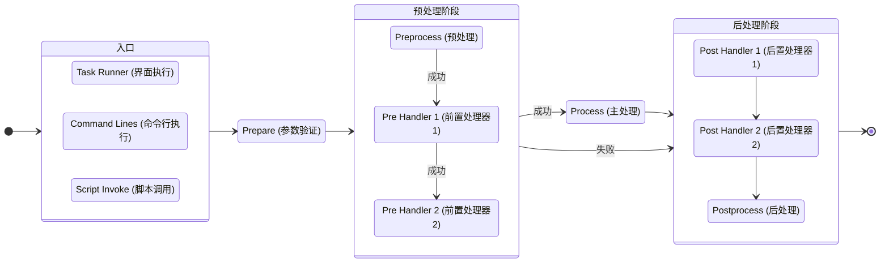

# XEditor.Tasks

[](https://www.npmjs.com/package/org.eframework.u3d.edit)
[](https://www.npmjs.com/package/org.eframework.u3d.edit)
[](https://deepwiki.com/eframework-org/U3D.EDIT)

XEditor.Tasks 提供了一个编辑器任务调度系统，基于 C# Attribute 或 Npm Scripts 定义任务，支持可视化交互、命令行参数、脚本调用等方式同步/异步执行任务。

## 功能特性

- 可视化任务管理器：直观地管理和执行任务
- 任务分组和优先级：细粒度控制任务执行顺序
- 多种任务声明方式：基于 C# Attribute 或 Npm Scripts 定义任务
- 前置和后置处理器：完整的任务生命周期管理机制
- 支持批处理模式：命令行自动执行无需界面交互

## 使用手册

### 1. 基础用法

#### 1.1 打开视图

通过菜单项 `Tools/EFramework/Task Runner` 打开任务管理面板。

```csharp
// 也可以通过代码打开
XEditor.Tasks.Panel.Open();
```

#### 1.2 执行任务

任务可以通过任务管理器界面执行，也可以通过代码直接执行：

```csharp
// 创建任务实例
var worker = new MyTask();

// 设置任务参数
var args = new Dictionary<string, string> { 
    { "参数名", "参数值" } 
};

// 执行任务
var report = XEditor.Tasks.Execute(worker, args);

// 等待任务完成
report.Task.Wait();

// 检查执行结果
if (report.Result == XEditor.Tasks.Result.Succeeded) {
    Debug.Log("任务执行成功");
} else {
    Debug.LogError($"任务执行失败: {report.Error}");
}
```

### 2. 自定义任务

#### 2.1 定义任务

##### 2.1.1 基于 C# Attribute 定义任务

通过继承 Worker 基类或实现 IWorker 接口定义任务：

```csharp
[XEditor.Tasks.Worker("我的任务", "任务分组", "任务说明")]
public class MyTask : XEditor.Tasks.Worker
{
    [XEditor.Tasks.Param("参数1", "参数说明", "默认值")]
    public string MyParam;
    
    public override void Process(XEditor.Tasks.Report report)
    {
        // 获取任务参数
        var value = report.Arguments.TryGetValue("参数1", out var val) ? val : "";
        
        // 执行任务逻辑
        Debug.Log($"执行任务，参数值: {value}");
        
        // 任务成功完成
        report.Result = XEditor.Tasks.Result.Succeeded;
    }
}
```

##### 2.1.2 基于 Npm Scripts 定义任务

通过 package.json 中的 scriptsMeta 配置定义任务：

```json
{
  "name": "my-package",
  "version": "1.0.0",
  "scripts": {
    "build": "echo 执行构建",
    "test": "echo 执行测试"
  },
  "scriptsMeta": {
    "build": {
      "name": "构建任务",
      "group": "构建",
      "tooltip": "执行项目构建",
      "priority": 1,
      "singleton": true,
      "runasync": true,
      "params": [
        {
          "name": "env",
          "tooltip": "构建环境",
          "default": "dev",
          "persist": true,
          "platform": "Unknown"
        }
      ]
    },
    "test": {
      "name": "测试任务",
      "group": "测试",
      "priority": 2
    }
  }
}
```

scriptsMeta 中的每个键对应 scripts 中的脚本名称，值为任务配置对象：

| 配置项 | 类型 | 说明 | 默认值 |
|-------|------|------|-------|
| `name` | 字符串 | 任务显示名称 | 脚本名称 |
| `group` | 字符串 | 任务分组 | "Npm Scripts" |
| `tooltip` | 字符串 | 任务提示信息 | 空 |
| `priority` | 整数 | 任务优先级 | 0 |
| `singleton` | 布尔值 | 是否为单例任务 | false |
| `runasync` | 布尔值 | 是否异步执行 | true |
| `platform` | 字符串 | 任务适用平台 | "Unknown"(所有平台) |
| `params` | 数组 | 任务参数列表 | [] |

params 数组中的每个对象定义一个任务参数：

| 配置项 | 类型 | 说明 | 默认值 |
|-------|------|------|-------|
| `name` | 字符串 | 参数名称 | 必填 |
| `tooltip` | 字符串 | 参数提示信息 | 空 |
| `default` | 字符串 | 参数默认值 | 空 |
| `persist` | 布尔值 | 是否持久化保存 | false |
| `platform` | 字符串 | 参数适用平台 | "Unknown"(所有平台) |

#### 2.2 生命周期

任务包含三个主要阶段：预处理、处理和后处理：

```csharp
public override void Preprocess(XEditor.Tasks.Report report)
{
    // 任务执行前的准备工作
    Debug.Log("开始预处理");
}

public override void Process(XEditor.Tasks.Report report)
{
    // 任务主要逻辑
    Debug.Log("执行主处理");
}

public override void Postprocess(XEditor.Tasks.Report report)
{
    // 任务完成后的清理工作
    Debug.Log("执行后处理");
}
```

### 3. 高级功能

#### 3.1 任务流程图



#### 3.2 流程处理器

使用特性指定任务的依赖关系：

```csharp
// 定义处理器接口
internal interface MyPreHandler : XEditor.Event.Callback { void Process(params object[] args); }

// 实现处理器
internal class MyPreProcessor : MyPreHandler
{
    public int Priority => 0; // 处理器优先级
    public bool Singleton => true; // 是否为单例处理器

    void MyPreHandler.Process(params object[] args)
    {
        // 解码参数
        XEditor.Event.Decode(out var worker, out var report, args);
        
        // 处理逻辑
        Debug.Log("执行前置处理");
    }
}

// 在任务上应用处理器
[XEditor.Tasks.Pre(typeof(MyPreHandler))]
[XEditor.Tasks.Post(typeof(MyPostHandler))]
public class MySequentialTask : XEditor.Tasks.Worker
{
    // 任务实现
}
```

#### 3.3 批处理模式

命令行执行任务：

```bash
# 执行单个任务
Unity.exe -batchmode -projectPath /path/to/project -runTasks -taskID "MyTask" -param1 "value1"

# 执行多个任务并指定结果输出
Unity.exe -batchmode -projectPath /path/to/project -runTasks -taskID "Task1" -taskID "Task2" -runAsync -taskResults "results.json"
```

命令行参数说明：

| 参数 | 说明 | 示例 |
|------|------|------|
| `-runTasks` | 启用批处理模式，必须参数 |  |
| `-taskID` | 指定要执行的任务ID，可多次使用以执行多个任务 | `-taskID "Build/WebGL"` |
| `-runAsync` | 设置任务为异步执行模式 |  |
| `-taskResults` | 指定结果报告的输出文件路径 | `-taskResults "D:/results.json"` |
| `--参数名` | 为任务提供参数 | `--Test Param=Test Value` |

批处理模式下的参数处理规则：

1. 每个 `-taskID` 后面的参数会应用到该任务，直到遇到下一个 `-taskID`
2. 如果任务列表中存在同步任务，所有任务都会以同步方式执行
3. 任务执行结果会以 JSON 格式保存到 `-taskResults` 指定的文件中
4. 在批处理模式下，任务执行完成后会自动退出 Unity 编辑器，返回码为 0（成功）或 1（失败）

#### 3.4 参数优先级

参数读取遵循以下优先级：

1. 命令行参数（最高优先级）
2. 任务管理器界面设置的参数
3. XPrefs 中存储的持久化参数
4. 参数特性中定义的默认值（最低优先级）

## 常见问题

### 1. 如何处理任务执行时的错误?

在任务的 Process 方法中使用 try-catch 捕获异常，并将错误信息记录到 Report 对象中：

```csharp
public override void Process(XEditor.Tasks.Report report)
{
    try
    {
        // 任务逻辑
    }
    catch (Exception e)
    {
        report.Error = e.Message;
        report.Result = XEditor.Tasks.Result.Failed;
    }
}
```

### 2. 如何防止任务重复执行?

将任务的 Singleton 属性设置为 true，系统会自动防止重复执行：

```csharp
public class MyTask : XEditor.Tasks.Worker
{
    public override bool Singleton => true;
    
    // 其他实现
}
```

### 3. 如何处理平台特定的任务?

使用 Platform 属性指定任务适用的平台：

```csharp
[XEditor.Tasks.Worker("Windows 任务", platform: XEnv.PlatformType.Windows)]
public class WindowsTask : XEditor.Tasks.Worker
{
    // Windows 平台特定实现
}
```

### 4. 如何在任务上下文共享数据?

可以通过 Report.Extras 属性传递数据：

```csharp
// 在一个任务中设置数据
public override void Process(XEditor.Tasks.Report report)
{
    report.Extras = new Dictionary<string, object> { 
        { "key", "value" } 
    };
}

// 在后置处理器中读取数据
void MyPostHandler.Process(params object[] args)
{
    XEditor.Event.Decode(out var worker, out var report, args);
    var data = report.Extras as Dictionary<string, object>;
    if (data != null && data.TryGetValue("key", out var value))
    {
        Debug.Log($"共享数据: {value}");
    }
}
```

更多问题，请查阅[问题反馈](../CONTRIBUTING.md#问题反馈)。

## 项目信息

- [更新记录](../CHANGELOG.md)
- [贡献指南](../CONTRIBUTING.md)
- [许可证](../LICENSE.md)
